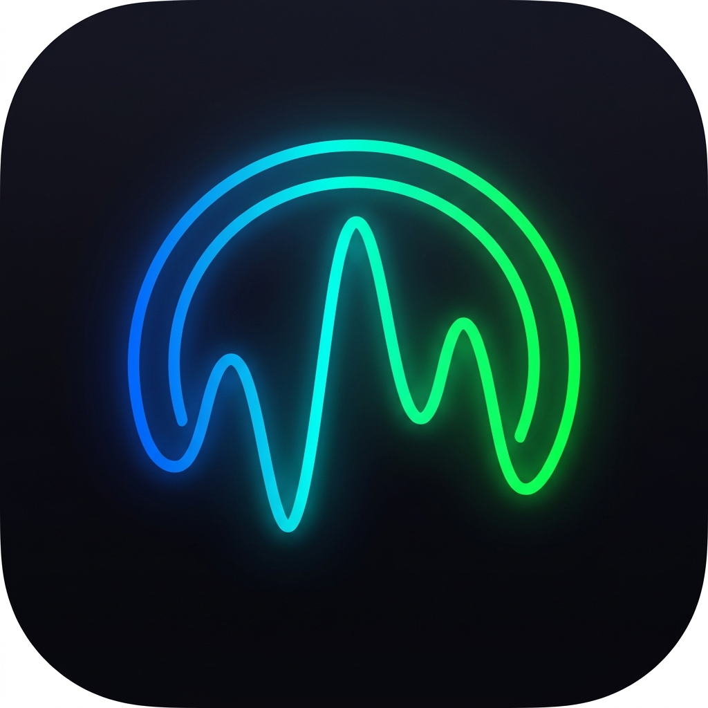
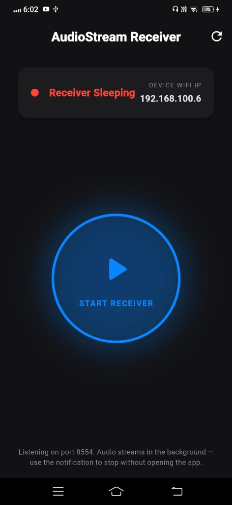
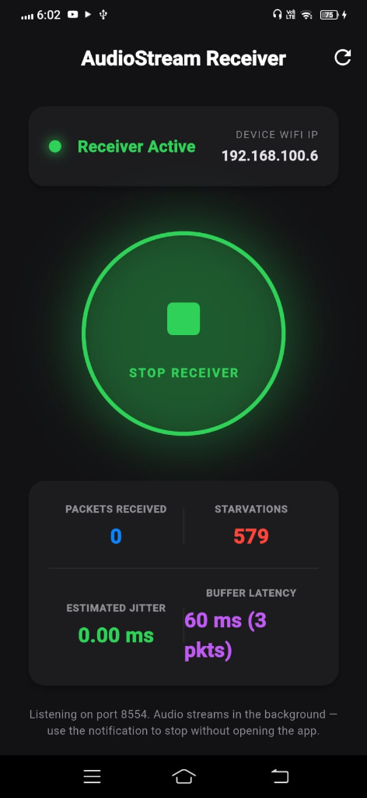
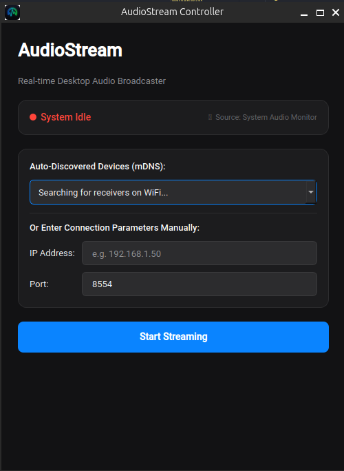

<div align="center">



# AudioStream

**Real-time, low-latency WiFi audio streaming from your PC to Android.**

*Stream your desktop audio to any Android device on your local network — wirelessly, instantly, with no cables and no cloud.*

[](LICENSE)
[](https://github.com/0xSubhan/AudioStream/releases)
[](https://github.com/0xSubhan/AudioStream/releases)
[](core/)
[](pc_app/)
[](android_app/)
[](https://github.com/0xSubhan/AudioStream/releases/latest)

<br/>

[**⬇ Download for Linux**](https://github.com/0xSubhan/AudioStream/releases/latest/download/AudioStream) &nbsp;·&nbsp;
[**⬇ Download for Windows**](https://github.com/0xSubhan/AudioStream/releases/latest/download/AudioStream.exe) &nbsp;·&nbsp;
[**⬇ Get the Android APK**](https://github.com/0xSubhan/AudioStream/releases/latest/download/AudioStream-arm64-v8a.apk) &nbsp;·&nbsp;
[**How It Works**](#-how-it-works) &nbsp;·&nbsp;
[**Contributing**](#-contributing)

</div>

---

## Screenshots

<table>
  <tr>
    <th align="center">Android — Idle</th>
    <th align="center">Android — Receiving</th>
    <th align="center">PC Controller</th>
  </tr>
  <tr>
    <td align="center">
      
    </td>
    <td align="center">
      
    </td>
    <td align="center">
      
    </td>
  </tr>
</table>

---

## Features

<table>
  <tr>
    <td width="50%">

### Performance First
- **Sub-40ms end-to-end latency** target
- **Opus codec** — same tech used by Discord & Zoom
- **20ms audio frames** with VBR low-latency mode
- **Zero-copy** RTP/UDP transport — no TCP overhead

  </td>
  <td width="50%">

### Just Works
- **mDNS auto-discovery** — no IP address entry needed
- **Zero dependencies** for end users (self-contained binary)
- **Android Foreground Service** — keeps streaming with screen off
- **Auto-reconnect** on network interruption

  </td>
  </tr>
  <tr>
    <td width="50%">

### Adaptive Intelligence
- **RFC 3550-compliant** adaptive jitter buffer
- **Dynamic buffer scaling** from 40ms → 160ms
- **Drift correction** prevents audio desync over time
- **Real-time telemetry** on both PC and Android

  </td>
  <td width="50%">

### Premium Audio Quality
- **AAudio exclusive mode** on Android for lowest latency
- **Low-latency performance** mode with hardware acceleration
- **Seamless playback** — no pops, clicks, or glitches
- **48 kHz stereo** capture from any system audio output

  </td>
  </tr>
</table>

---

## Architecture

```
┌──────────────────────────────────────────────────────────────────────┐
│                         PC (Linux)                                    │
│                                                                       │
│  ┌──────────────┐    ┌──────────────┐    ┌──────────────────────┐   │
│  │  PulseAudio  │───▶│ Opus Encoder │───▶│    RTP/UDP Sender    │   │
│  │  / PipeWire  │    │   (C++ lib)  │    │  (C++ — 20ms pkts)   │   │
│  └──────────────┘    └──────────────┘    └──────────┬───────────┘   │
│                                                      │               │
│  ┌─────────────────────────────────────────────┐    │               │
│  │         PyQt6 Controller UI                  │    │               │
│  │  • mDNS auto-discovery (Zeroconf)            │    │               │
│  │  • Live telemetry (latency, packets)         │    │               │
│  └─────────────────────────────────────────────┘    │               │
└─────────────────────────────────────────────────────┼───────────────┘
                                                       │ WiFi / LAN
                                            UDP/RTP packets
                                            (Opus-compressed)
                                                       │
┌─────────────────────────────────────────────────────┼───────────────┐
│                        Android                       ▼               │
│                                                                       │
│  ┌──────────────┐    ┌──────────────┐    ┌──────────────────────┐   │
│  │ AAudio Output│◀───│ Opus Decoder │◀───│  Adaptive Jitter Buf │   │
│  │ (Exclusive + │    │   (C++ lib)  │    │  (RFC 3550, C++)      │   │
│  │  Low-latency)│    └──────────────┘    └──────────────────────┘   │
│  └──────────────┘                                                     │
│                                                                       │
│  ┌─────────────────────────────────────────────┐                    │
│  │      Flutter UI + Foreground Service         │                    │
│  │  • Live jitter/buffer/packet telemetry       │                    │
│  │  • Persistent notification while streaming   │                    │
│  └─────────────────────────────────────────────┘                    │
└──────────────────────────────────────────────────────────────────────┘
```

### Tech Stack

| Layer | PC Side (Linux) | PC Side (Windows) | Android Side |
|---|---|---|---|
| **UI** | Python 3 + PyQt6 | Python 3 + PyQt6 | Flutter (Dart) |
| **Audio Capture** | PulseAudio / PipeWire | WASAPI loopback | AAudio (NDK) |
| **Codec** | Opus (C++ via libopus) | Opus (C++ via libopus) | Opus (C++ via libopus) |
| **Transport** | RTP/UDP (custom C++) | RTP/UDP (custom C++) | RTP/UDP (custom C++) |
| **Discovery** | mDNS via Zeroconf | mDNS via Zeroconf | mDNS via NsdManager |
| **JNI Bridge** | pybind11 | pybind11 | Kotlin JNI |
| **Build** | CMake 3.22+ | CMake + MSVC/MinGW | Gradle + CMake |

---

## Performance

Measured on a Ryzen 5 machine streaming to a Pixel 7 over 5GHz WiFi:

| Metric | Value |
|---|---|
| **End-to-end latency** | ~25–38 ms |
| **Capture latency (PC)** | ~1.8 ms |
| **Jitter buffer range** | 40 ms – 160 ms (adaptive) |
| **Codec frame size** | 20 ms |
| **Bitrate** | ~64–128 kbps (VBR) |
| **Sample rate** | 48,000 Hz stereo |
| **Packet loss tolerance** | Up to ~5% with concealment |

> **Note:** Latency varies by network quality. A 5GHz WiFi connection with both devices close to the router gives the best results.

---

## How It Works

<details>
<summary><b>1. Audio Capture (PC)</b></summary>
<br/>

The PC app hooks into PulseAudio's monitor source — a virtual audio device that mirrors whatever is playing through your speakers or headphones. This means AudioStream captures all system audio without any loopback cable or virtual audio driver tricks.

The `PulseCaptureEngine` (C++) opens a non-blocking stream at 48kHz stereo, reads frames of ~960 samples (20ms at 48kHz), and feeds them directly to the Opus encoder.

</details>

<details>
<summary><b>2. Encoding (Opus)</b></summary>
<br/>

Each 20ms audio frame is compressed with **libopus** in low-delay mode (`OPUS_APPLICATION_RESTRICTED_LOWDELAY`). This mode is purpose-built for real-time communication — it skips look-ahead analysis to minimize algorithmic delay.

VBR is enabled, allowing the bitrate to drop during silence and rise during complex audio, giving the best quality-per-bit ratio. A typical music stream runs at 64–128 kbps — a fraction of uncompressed audio's ~1.5 Mbps.

</details>

<details>
<summary><b>3. RTP/UDP Transport</b></summary>
<br/>

Encoded frames are wrapped in **RTP packets** (RFC 3550) with sequence numbers and timestamps. UDP is used intentionally over TCP — a dropped packet means a tiny glitch, but a retransmitted packet would arrive too late to be useful. RTP's sequence numbers let the receiver detect and handle packet loss gracefully.

The `UDPSender` (C++) sends packets directly to the Android device's IP and port. **mDNS (Zeroconf)** handles device discovery — the Android app registers itself on the local network, and the PC app finds it automatically without any manual IP entry.

</details>

<details>
<summary><b>4. Adaptive Jitter Buffer (Android)</b></summary>
<br/>

WiFi networks introduce variable delay (jitter). The **adaptive jitter buffer** absorbs this by holding packets for a short window before playing them, smoothing out the delivery. It dynamically adjusts its depth (40–160ms) based on measured network jitter using RFC 3550's inter-arrival time algorithm.

Drift correction prevents the buffer from gradually growing or shrinking over long sessions as the PC and Android clocks drift apart.

</details>

<details>
<summary><b>5. Playback (Android AAudio)</b></summary>
<br/>

Decoded PCM audio is written to an **AAudio stream** opened in `EXCLUSIVE` performance mode with `LOW_LATENCY` performance class. This bypasses Android's audio mixing layer for the lowest possible hardware latency, giving AudioStream the same audio path as high-end music apps.

The stream runs in its own high-priority real-time thread to prevent glitches from background processes.

</details>

---

## Getting Started

### For End Users (Windows PC)

> No Python, cmake, or build tools required.

**Step 1 — Download the PC app**

Go to the [**Releases page**](https://github.com/0xSubhan/AudioStream/releases/latest) and download `AudioStream.exe`.

Double-click `AudioStream.exe` to run — no installation needed.

> **Note:** Windows may show a SmartScreen warning the first time ("Unknown publisher"). Click **More info → Run anyway** to proceed.

**Step 2 — Install the Android APK**

Download `AudioStream-arm64-v8a.apk` from the same releases page.

- Enable **"Install unknown apps"** in your Android settings (one-time)
- Open the APK file on your phone to install it
- If **Google Play Protect** shows a warning, tap **"Install anyway"** — this is normal for apps not distributed through the Play Store

**Step 3 — Stream!**

1. Open **AudioStream** on your Android phone → tap **START RECEIVER**
2. Open **AudioStream.exe** on your Windows PC
3. Your phone appears automatically in the dropdown — select it and click **Start Streaming**
4. Audio from your PC streams to your phone instantly

> Both devices must be on the **same WiFi network**.

---

### For End Users (Linux PC)

> No Python, cmake, or build tools required.

**Step 1 — Download the PC app**

Go to the [**Releases page**](https://github.com/0xSubhan/AudioStream/releases/latest) and download `AudioStream`.

```bash
chmod +x AudioStream
./AudioStream
```

**Step 2 — Install the Android APK**

Download `AudioStream-arm64-v8a.apk` from the same releases page.

- Enable **"Install unknown apps"** in your Android settings (one-time)
- Open the APK file on your phone to install it
- If **Google Play Protect** shows a warning, tap **"Install anyway"** — this is normal for apps not distributed through the Play Store

**Step 3 — Stream!**

1. Open **AudioStream** on your Android phone → tap **START RECEIVER**
2. Open the **AudioStream Controller** on your PC
3. Your phone appears automatically in the dropdown — select it and click **Start Streaming**
4. Audio from your PC streams to your phone instantly

> Both devices must be on the **same WiFi network**.

---

### For Developers

#### Prerequisites

**Linux:**
```
cmake >= 3.22        GCC/Clang (C++17)     Python 3.10+
libpulse-dev         libopus-dev            Flutter 3.x
```

Install system dependencies (Ubuntu/Debian):
```bash
sudo apt install cmake gcc libpulse-dev libopus-dev python3-venv
```

**Windows:**
```
CMake 3.22+          Visual Studio 2022 Build Tools (C++ workload)
Python 3.10+         vcpkg (for Opus)        Flutter 3.x
```

Install Windows prerequisites:
```powershell
# 1. Install vcpkg (if not already)
git clone https://github.com/microsoft/vcpkg C:\vcpkg
C:\vcpkg\bootstrap-vcpkg.bat
C:\vcpkg\vcpkg integrate install

# 2. Install Opus via vcpkg
C:\vcpkg\vcpkg install opus:x64-windows

# 3. Set environment variable for the build script
[System.Environment]::SetEnvironmentVariable('VCPKG_ROOT','C:\vcpkg','User')
```

#### One-command build (Linux)

```bash
git clone https://github.com/0xSubhan/AudioStream.git
cd AudioStream
chmod +x build_release.sh
./build_release.sh
```

This compiles the C++ engine, sets up a Python venv, installs all dependencies, and bundles everything into `dist/AudioStream` via PyInstaller.

#### One-command build (Windows)

```bat
git clone https://github.com/0xSubhan/AudioStream.git
cd AudioStream
build_release_windows.bat
```

This compiles the C++ WASAPI engine, sets up a Python venv, and bundles everything into `dist\AudioStream.exe` via PyInstaller.

#### Or run from source (Linux)

```bash
# 1. Build the C++ engine
mkdir -p build && cd build
cmake .. -DCMAKE_BUILD_TYPE=Release
make -j$(nproc)
cd ..

# 2. Launch the PC broadcaster
./run_pc_app.sh
```

#### Build the Android APK

```bash
cd android_app
flutter pub get
flutter build apk --release
adb install -r build/app/outputs/flutter-apk/app-release.apk
```

---

## Project Structure

```
AudioStream/
│
├── core/                          # C++ audio engine (shared logic)
│   ├── include/
│   │   ├── capture.h              # Abstract audio capture interface
│   │   ├── pulse_capture.h        # PulseAudio capture (Linux)
│   │   ├── wasapi_capture.h       # WASAPI loopback capture (Windows)
│   │   ├── opus_encoder.h         # Opus encoder wrapper
│   │   ├── opus_decoder.h         # Opus decoder wrapper
│   │   ├── rtp_packet.h           # RTP packet serialization (RFC 3550)
│   │   ├── udp_sender.h           # Cross-platform UDP socket sender
│   │   └── stream_controller.h   # Top-level streaming orchestrator
│   └── src/
│       ├── pulse_capture.cpp      # Linux PulseAudio implementation
│       ├── wasapi_capture.cpp     # Windows WASAPI implementation
│       ├── opus_encoder.cpp
│       ├── opus_decoder.cpp
│       ├── udp_sender.cpp         # Cross-platform (Winsock2 / POSIX)
│       ├── stream_controller.cpp  # Selects capture backend via #ifdef
│       └── bindings.cpp           # pybind11 Python bindings
│
├── pc_app/                        # Python PC broadcaster UI
│   ├── app.py                     # PyQt6 controller (mDNS + telemetry)
│   ├── requirements.txt
│   └── AudioStream.spec           # PyInstaller bundle config
│
├── android_app/                   # Flutter + C++ Android receiver
│   ├── lib/main.dart              # Flutter UI + method channels
│   └── android/app/src/main/
│       ├── cpp/
│       │   ├── android_receiver_engine.cpp  # AAudio playback engine
│       │   └── jitter_buffer.h              # Adaptive jitter buffer
│       └── kotlin/
│           ├── MainActivity.kt              # JNI bridge + permission handling
│           ├── ReceiverEngine.kt            # Kotlin JNI interface
│           └── AudioReceiverService.kt      # Android Foreground Service
│
├── tests/                         # C++ unit tests
│   ├── test_capture.cpp
│   ├── test_opus.cpp
│   └── test_sender.cpp
│
├── docs/
│   ├── design_log.md              # Architecture decisions & changelog
│   ├── CI_PIPELINE_DOC.md         # CI pipeline explained in detail
│   └── screenshots/
│
├── build_release.sh               # One-shot Linux release builder
├── build_release_windows.bat      # One-shot Windows release builder
├── run_pc_app.sh                  # Quick source-run launcher (Linux)
└── CMakeLists.txt                 # Root CMake build file (cross-platform)
```

---

## Roadmap

| Status | Feature |
|---|---|
| ✅ | Linux PC broadcaster (PulseAudio/PipeWire) |
| ✅ | Android receiver with AAudio exclusive mode |
| ✅ | Opus encoding/decoding with low-delay mode |
| ✅ | RFC 3550 adaptive jitter buffer with drift correction |
| ✅ | mDNS/Zeroconf auto-discovery |
| ✅ | Android Foreground Service (screen-off streaming) |
| ✅ | Real-time telemetry (latency, jitter, packet count) |
| ✅ | Self-contained PC binary (PyInstaller — no install needed) |
| ✅ | Windows PC broadcaster (WASAPI loopback) |
| 🔲 | macOS PC broadcaster (CoreAudio) |
| 🔲 | FEC (Forward Error Correction) for lossy networks |
| 🔲 | Volume control in PC app |
| 🔲 | Multiple simultaneous receivers |
| 🔲 | Android → PC streaming (reverse direction) |

---

## Documentation

| Document | Description |
|----------|-------------|
| [CI Pipeline Doc](docs/CI_PIPELINE_DOC.md) | How the GitHub Actions CI works — all 3 build pipelines explained in detail |
| [Design Log](docs/design_log.md) | Architecture decisions, technical changelog, and phase-by-phase development notes |

---

## Contributing

Contributions are welcome! Here's how to get started:

1. **Fork** the repository
2. **Create a branch** — `git checkout -b feature/your-feature`
3. **Make your changes** and ensure the C++ tests pass:
   ```bash
   cd build && ./bin/test_capture && ./bin/test_opus && ./bin/test_sender
   ```
4. **Commit** with a clear message following [Conventional Commits](https://www.conventionalcommits.org/)
5. **Open a Pull Request** — describe what you changed and why

### Areas that need help
- **macOS support** — CoreAudio backend
- **More tests** — especially network/jitter simulation
- **Documentation** — architecture deep-dives, API docs

---

## License

This project is licensed under the **MIT License** — see the [LICENSE](LICENSE) file for details.

---

## Acknowledgments

- [**libopus**](https://opus-codec.org/) — The Opus codec for incredible audio compression
- [**pybind11**](https://github.com/pybind/pybind11) — Seamless C++/Python interop
- [**python-zeroconf**](https://github.com/python-zeroconf/python-zeroconf) — Pure-Python mDNS implementation
- [**PyInstaller**](https://pyinstaller.org/) — Bundling Python apps into standalone executables
- [**AAudio**](https://developer.android.com/ndk/guides/audio/aaudio/aaudio) — Android's low-latency native audio API
- [**Flutter**](https://flutter.dev/) — Cross-platform UI toolkit for the Android receiver

---

<div align="center">

Made with ❤️ by [0xSubhan](https://github.com/0xSubhan)

⭐ **If AudioStream is useful to you, please consider giving it a star!** ⭐

</div>
